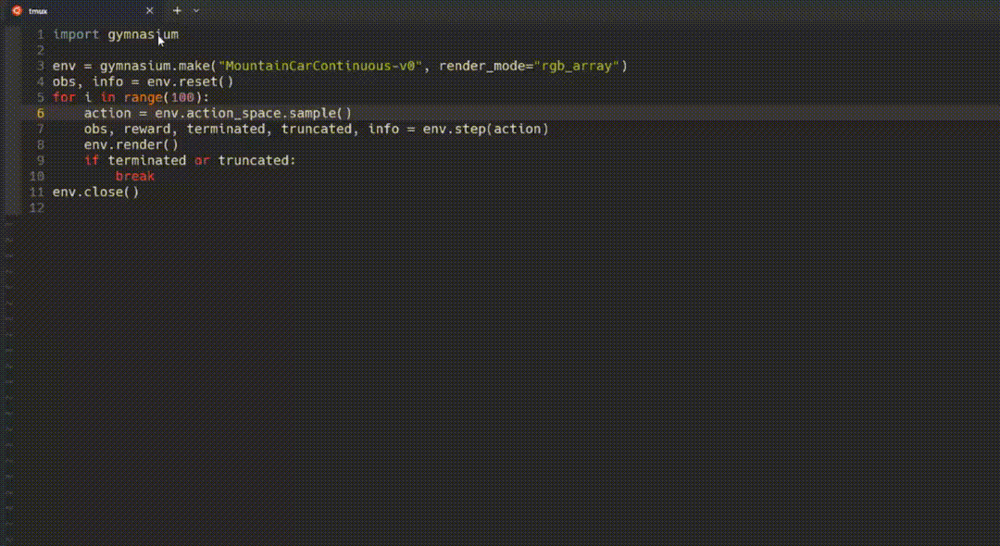

# 🚀 **Loopquest**

*A Production Tool for Embodied AI.*



---

## 📌 **Major Features**

✔️ **Imitation Learning & Offline Reinforcement Learning MLOps**
   - Log observation, action, reward, and rendered images with **just one extra line of code**.

```python
import loopquest
loopquest.init()
env = loopquest.make_env("MountainCarContinuous-v0", render_mode="rgb_array")
```

✔️ **Evaluate Local & Remote Policies**
   - **Local Policy Evaluation**
   ```python
   from loopquest.eval import evaluate_local_policy
   evaluate_local_policy(policy, ["FetchPickAndPlace-v2"], num_episodes=1)
   ```
   
   - **Remote Policy Evaluation**
   ```python
   from loopquest.eval import evaluate_remote_policy
   evaluate_remote_policy("jxx123/ppo-LunarLander-v2", "ppo-LunarLander-v2.zip", "PPO", ["LunarLander-v2"], num_episodes=1)
   ```

✔️ **Trainable Data for Robotics Foundation Models**
   - Easily download structured datasets with **TensorFlow, PyTorch, or Hugging Face APIs**.
   ```python
   from loopquest.datasets import load_dataset
   ds = load_dataset("your_experiment_id")
   ```

✔️ **Complete MLOps Features**
   - **Data visualization**, **simulation rendering**, and **experiment management**.

---

## ⚡ **Installation**

For the stable version:
```bash
pip install loopquest
```

For development or contributions:
```bash
git clone https://github.com/LoopMind-AI/loopquest.git
cd loopquest
pip install -e .
```

---

## 🎯 **Quick Start Examples**

🔹 **Run Local Evaluation**
```python
from loopquest.eval import evaluate_local_policy
policy = RandomPolicy(env.action_space)
evaluate_local_policy(policy, ["FetchPickAndPlace-v2"], num_episodes=1)
```

🔹 **Run Remote Evaluation**
```python
from loopquest.eval import evaluate_remote_policy
evaluate_remote_policy("jxx123/ppo-LunarLander-v2", "ppo-LunarLander-v2.zip", "PPO", ["LunarLander-v2"], num_episodes=1)
```

🔹 **Environment Wrapper Example**
```python
import loopquest
env = loopquest.make_env("MountainCarContinuous-v0", render_mode="rgb_array")
obs, info = env.reset()
for _ in range(100):
    action = env.action_space.sample()
    obs, reward, terminated, truncated, info = env.step(action)
    if terminated or truncated:
        break
env.close()
```

---

## 🌎 **Community & Support**

💬 **Join Our Discord:** [Click Here](https://discord.gg/FTnFYeSy9r) 🏡
🎥 **Watch Quickstart Demos:** [Demo 1](https://capture.dropbox.com/embed/CpS8Y4g21ClHlief) | [Demo 2](https://capture.dropbox.com/AOF5rGxHWyRb9T58)

---

💡 *Loopquest is designed to simplify AI-driven robotics. Give it a try and start building today!* ✨
